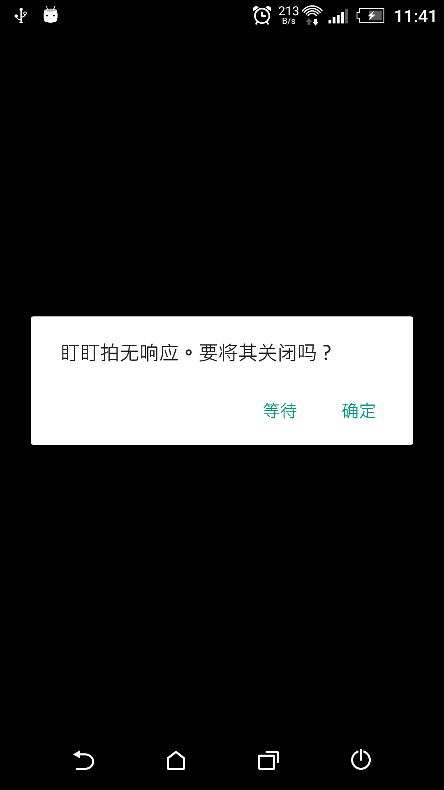
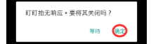
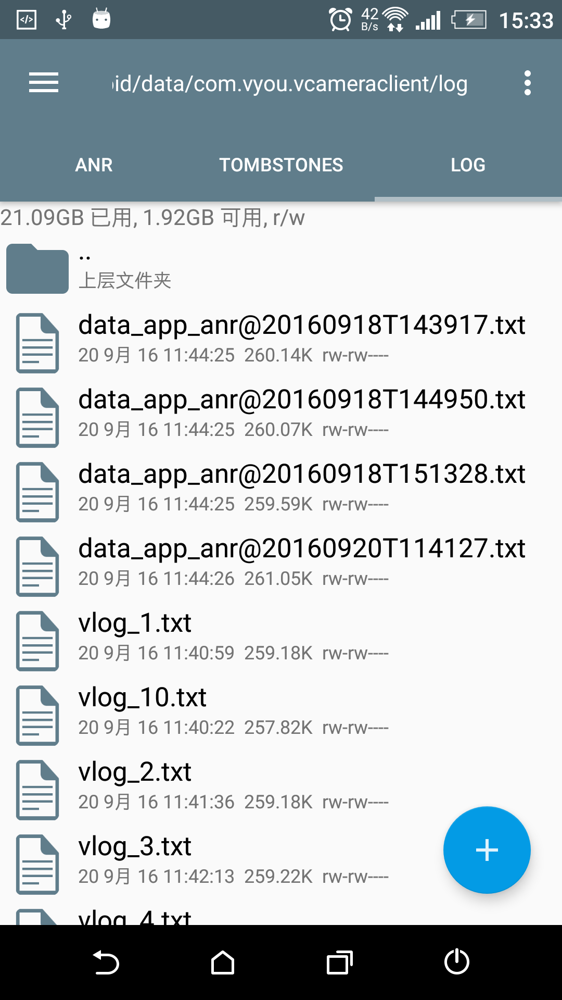

# ANR（Application Not Responding）日志收集

##名词解析
ANR：[点击跳转到百度百科](http://baike.baidu.com/link?url=o4dEs5KLuCEqlPjDZROh_tL92PA0DoQu3I1qH7_LlHAyKSXfmO2wA2tkEctRN8uS7Dxw2pEq31-tcpNFS36SS_)

##收集
现在已经集成了ANR日志收集功能，当App出现了类似如下无响应（ANR:Application Not Responding）弹窗时

###按如下步骤收集ANR日志。

1. 点击无响应弹窗中的确定按钮，此时App会关闭。

 

2. 然后再次打开App，此时，盯盯拍会扫描五分钟以前到现在的ANR日志，如果有相应日志则会将其写入到log目录下（如下图所示）。

   
   
   以data_app_anr@xxxxxx命名的就是ANR日志。后面的时间含义为：年月日T时分秒
   
3. 将其连同日志文件一同提交到BugTrace(禅道)或者直接发给相应的开发人员