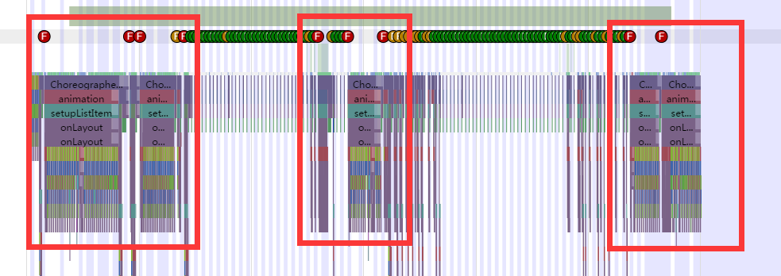
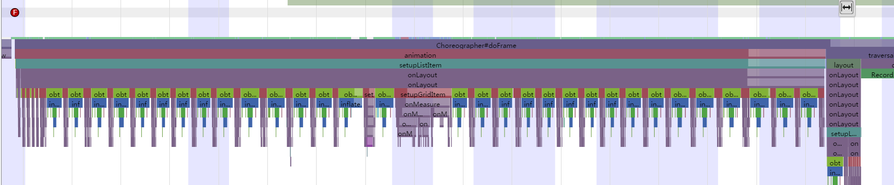
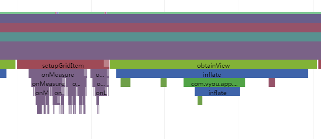

# 界面滚动流畅度优化

## AlbumThumbActivity(相册缩略图）

#### 工具
Chrome + Systrace

#### 测量结果截图(截图顺序是逐渐放大的）：

上面是滑动三秒的测试截图，有背景是蓝白互相间隔的，蓝色和白色各代表一帧（16ms）。红色圈出来的部分，可以看到，这就是卡顿（掉帧）的地方。放大看看主要做了什么耗时的操作

可以看到是由于GridView多次的inflate导致的。

####分析

查阅代码，可以了解到，这个界面的实现方式ListView中嵌入GridView实现的。当末一天的图片较少时，突然加载到某一天图片张数较多的时候，就会触发多次的inflate创建布局。这就是导致滚动卡顿的原因。

####解决方案

采用ListView或者RecyclerView实现多种类型Item的布局（这里只要把时间当做一种Item，一行照片当做一种Item，也就是只需要两种类型的布局）。这样就能很好的重复使用inflate的布局。

## 图片分享页面
#### 工具
Chrome + Systrace
#### 测量结果截图
