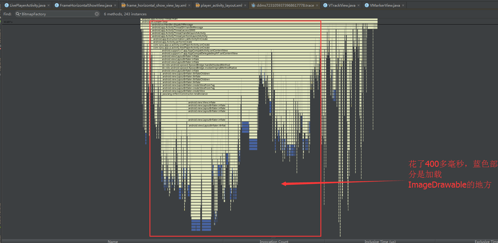
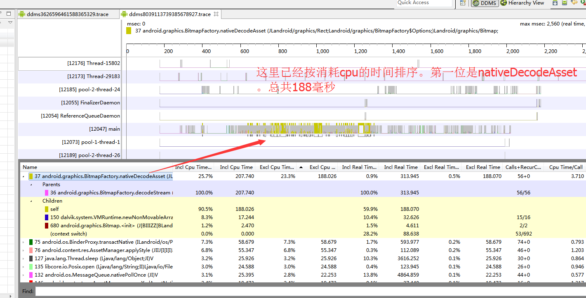
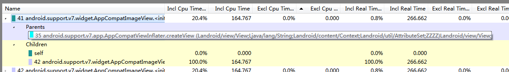

# 界面跳转优化

## LivePlayerActivity（进入预览界面）

工具：DDMS Method Profile  + Android Studio

测试结果截图：

分析

这里已经通过搜索功能过滤出来，蓝色部分就是加载ImageDrawable的地方。主线程在解析布局文件中设置的Drawable时，会使用BitmapFactory解码图片。这在加载少量图片的时候是不会有明显的问题，但是预览界面加载了很多布局，所有布局里面的ImageDrawable加起来数量就很多了。

解决方案

减少不必要的布局加载。准确的说，应该是减少AbsPlayerActivity的布局加载。

## NetworkPlayerActivity（进入网络视频播放）

工具：DDMS Method Profile  + Android Studio

测试截图：

不断向上层追溯，我们可以看到，就是在inflater布局的时候消耗的，与LivePlayerActivity类似

分析

这个跟LivePlayerActivity的原因一样。其实原因很简单，他们两个都继承了AbsPlayerActivity（这里面执行了横竖屏两个布局的创建）。

解决方案

减少不必要的布局加载。准确的说，应该是减少AbsPlayerActivity的布局加载

