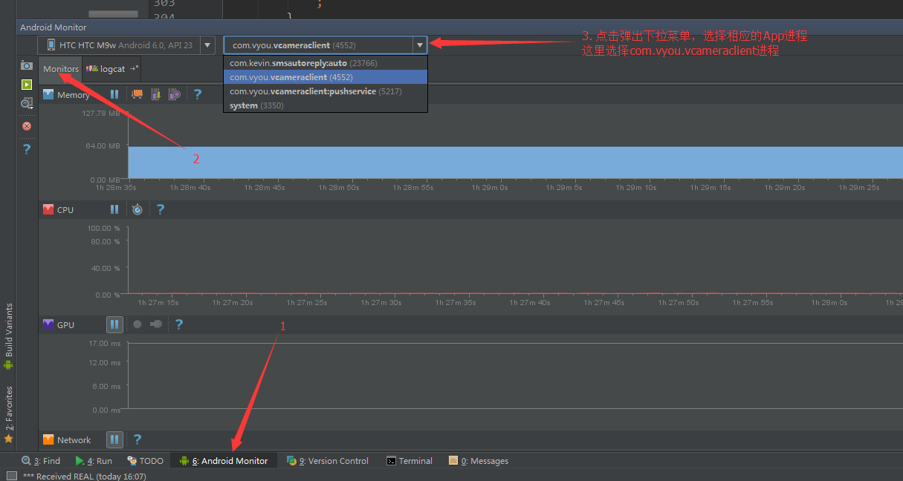

#内存分析

##原因
为什么要进行内存分析？

原因一：频繁GC导致UI线程卡顿

如果程序出现大量的内存分配和释放，就意味着产生了频繁的GC。当GC线程运行时，其他线程会停止工作（包括UI线程），直到GC完成。所以频繁的GC，必然会导致UI线程的卡顿。特别是性能比较差的手机上，尤为明显。

原因二：内存泄漏

如果程序出现大量的内存分配，而GC无法回收(一般都是因为有强引用在引用该对象，也就是所谓的内存泄漏），那就会导致程序最终因为内存枯竭而崩溃。在程序上的表现，就是抛出OutOfMemory异常。

只有出现上面两种情况的时候才需要进行内存分析！

##分析手段
通过AndroidStudio自带的Monitors工具集中的Memory工具来分析。

##使用Memory工具分析频繁GC

频繁GC在Memory监视工具中的表现是出现了大量锯齿状的页面。

###1. 选择要监视的线程

###2. 观察内存状况

1. 手动触发GC 
2. 点击监视按钮，开始监视，按钮状态变为，再次点击后结束监视

3. 结束监视后会得到结果文件

4. 结婚
